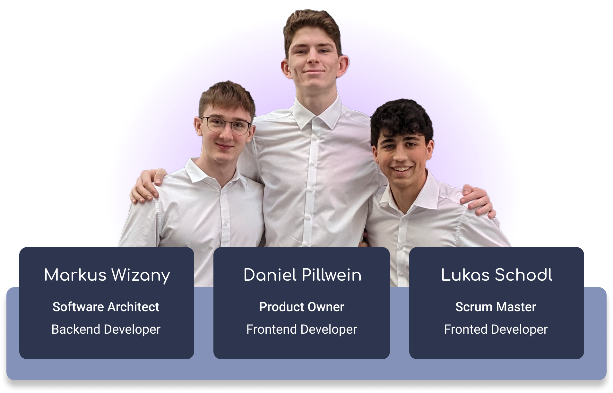

# OpenSoundQueue 

<div style="display: flex; align-items: center;">
  
  <div>
    <p>OpenSoundQueue is a cutting-edge, open-source application that transforms group music listening. Built with a modular architecture, it's robust and adaptable, ready for future updates to meet users' evolving needs.</p>
  </div>
</div>

## Empowering Your Shared Music Experience

Perfect for private gatherings or public settings like restaurants and bars, OpenSoundQueue enhances music sharing with
unique features:

| Feature                  | Description                                                                                                   |
|--------------------------|---------------------------------------------------------------------------------------------------------------|
| **Multiple Sources**     | Integrates tracks from platforms like YouTube and SoundCloud into a unified queue for varied music selection. |
| **Security & Privacy**   | Offers public and private queues with access control, ensuring session privacy and participant exclusivity.   |
| **Moderation & Control** | Equipped with moderation tools for balanced music selection and host control over the queue.                  |
| **Customizability**      | Provides extensive customization and encourages global developer contributions via GitHub.                    |
| **Multilingual Support** | Supports multiple languages for an inclusive, accessible user experience.                                     |

OpenSoundQueue delivers a memorable shared music experience, offering the flexibility to tailor the music environment
for any occasion.

## Badges

### Technologies Used


### Streaming Sources Supported


### Community and Quality


## Visuals

<p align="center">
   
</p>
<p align="center">Mockup of OpenSoundQueue</p>

<p align="center">
   
</p>
<p align="center">Example of Usage</p>


## Installation

To get OpenSoundQueue, download the latest release from the GitHub releases page:

- [GitHub Releases](https://github.com/OpenSoundQueue/OpenSoundQueue/releases)

Follow the instructions below after downloading the application from our project website or
the GitHub releases page.

1. **Open the Terminal or Command Prompt (CMD):**

    - On **Linux** or **macOS**, open your terminal.
    - On **Windows**, open your command prompt (CMD).

2. **Navigate to the Project Root:**

   Navigate to the folder where you've downloaded OpenSoundQueue. For example, if you've downloaded and extracted
   OpenSoundQueue to `Downloads/OpenSoundQueue`, you would enter:

   On **Linux** or **macOS**:
    ```bash
    cd ~/Downloads/OpenSoundQueue
    ```

   On **Windows**:
    ```batch
    cd Downloads\OpenSoundQueue
    ```

3. **Run the Installation Command:**

   Based on your operating system, run the appropriate command from the project root.

   For **Linux Ubuntu** users:
    ```bash
    ./installation_scripts/Linux\ Ubuntu/installation.bash
    ```

   For **Windows** users:
    ```batch
    installation_scripts\windows\setup.bat
    ```
   Make sure to navigate to the project root directory before running these commands, as they are relative to the root
   of the project.

4. **Follow the Web Installer Instructions:**

   After executing the installation script, a web installer will launch in your default web browser. Follow the
   on-screen instructions to complete the setup of OpenSoundQueue. This may include setting up an administrator account,
   configuring your music sources, and customizing application settings.

## Usage

<div style="display: flex; align-items: center;">
    <p>
      OpenSoundQueue is designed for communal music enjoyment, allowing groups to listen and manage a shared music queue
      collaboratively. It's perfect for private gatherings with friends or enhancing the atmosphere in public venues like
      restaurants, bars, and clubs. Tailor your music experience to fit any occasion with OpenSoundQueue.
    </p>

</div>

## Support

For any issues that might occur during development or usage of the application, please refer to the GitHub issue tab.

If the issue includes personal or confidential information, please reach out to our support email:

[info@opensoundqueue.org](mailto:info@opensoundqueue.org)

## Contributing

We warmly welcome contributions from anyone interested in improving OpenSoundQueue. Whether you're fixing a bug, adding
a new feature, or improving the documentation, your help is appreciated. Here's how you can contribute:

1. **Clone the Repository**

   Start by cloning the repository to your local environment using:
   ```bash
   git clone https://github.com/OpenSoundQueue/OpenSoundQueue.git
   ```

2. **Create a New Branch**

   Create a new branch with a descriptive name for your changes:
   ```bash
   git checkout -b feature/meaningful-name
   ```
   Remember to use meaningful commit messages that clearly describe each change.

3. **Consult the Documentation**

   Documentation for both the frontend and backend is available in the `docs` folder. This is a great place to start if
   you're new to the project or looking for specific implementation details.

4. **Develop Your Feature**

   With the setup complete, you're ready to start developing. Feel free to add new features, fix existing issues, or
   improve the documentation.

5. **Submit a Pull Request**

   Once you're satisfied with your work and have thoroughly tested your changes, submit a pull request. Ensure all bugs
   are addressed and your code conforms to the project's standards. Our developers will review your contribution, run
   additional tests, and provide feedback or approve your changes.

By contributing to OpenSoundQueue, you're helping to create a more enjoyable and collaborative music experience for
everyone. Thank you for your support and contributions!

## Authors and acknowledgment



### Connect with the authors on LinkedIn:

- [](https://www.linkedin.com/in/markus-wizany/)
- [](https://www.linkedin.com/in/daniel-pillwein/)
- [](https://www.linkedin.com/in/lukas-schodl/)

## License

This project is licensed under the Apache License, Version 2.0. Copyright © 2023 Lukas Schodl. All rights reserved.

Usage of the files and contributions to the repository are subject to the following conditions:

- The software is provided "AS IS", without warranty of any kind, express or implied.
- The full text of the license can be found at [Apache License 2.0](http://www.apache.org/licenses/LICENSE-2.0).

By using or contributing to this project, you agree to abide by its terms.